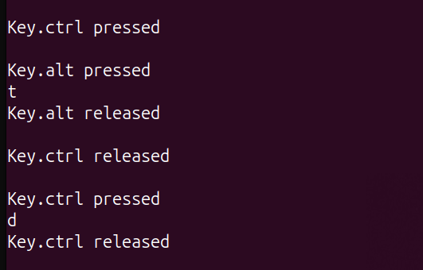

# Keylogger Project
Simple keylogger for Linux that logs keystrokes on a file, sends the log file and then deletes it.

Keylogger stops after pressing the Esc key. After the keylogger stops, the file will be sent to the provided email address and then deleted. Keys like Ctrl and Shift will be logged when they are both pressed and released to improve readability when logging certain key combinations, like Ctrl+C or Ctrl+Alt+T.

Example output:

* Ctrl+V being pressed:


* Opening terminal (Ctrl+Alt+T) and closing it (Ctrl+D):



## Installation
1. Clone this project
```bash
git clone https://github.com/Ana-Nav/keylogger-project
```
2. Install dependencies
```bash
cd keylogger-project
```
```bash
pip install -r requirements.txt
```

## Usage
Fill out the sender and recipient email addresses, along with the password for the sender address. You will need to genereate an App Password for the sender gmail adress:

1. Enable 2-Step Verification:

    Google Account’s Security Settings > Navigate to How you sign in to Google > Enable 2-Step Verification > Follow instructions
2. Generate App Password:

    Google Account's Security Settings > Search "App Passwords" on search bar > Choose a name for App Password

It's important to keep this password in a safe place since it is a way to access your account.

## Disclaimer

This project is intended for educational purposes.